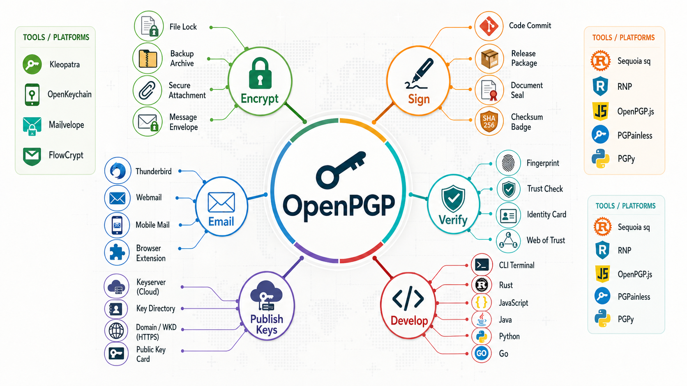

# Boise Code Camp OpenPGP Key Signing Party

Guides, handouts, and build scripts for running an OpenPGP key signing party at Boise Code Camp.

[](handouts/images/SixDegreesOfKevinBaconTrust.avif)

The event model is intentionally conservative:

- Attendees submit public key material before the event.
- The organizer validates submissions and prints a key list.
- At the event, participants verify government-issued photo ID and full OpenPGP fingerprints.
- Nobody signs keys at the event.
- After the event, attendees import the final key bundle, re-check fingerprints against their marked sheets, and sign only keys they personally verified.

## Current Event

- Event: Boise Code Camp key signing party
- Date: Saturday, May 2, 2026
- Official submission form: <https://forms.gle/61H58E9gjswN366KA>
- Submission deadline: Wednesday, April 29, 2026 at 11:59 PM Mountain Time
- Print freeze: Friday, May 1, 2026 at 12:00 PM Mountain Time
- Follow-up package deadline: Monday, May 4, 2026 at 11:59 PM Mountain Time

## Handouts

[Typst](https://typst.app/) source files and PDF versions live in [`handouts`](handouts):

- [attendee_pre_event_guide.pdf](handouts/attendee_pre_event_guide.pdf): attendee preparation, submission, event expectations, and post-event signing guidance ([typst source](handouts/attendee_pre_event_guide.typ))
- [organizer_pre_event_guide.pdf](handouts/organizer_pre_event_guide.pdf): organizer operating procedure and validation policy ([typst source](handouts/organizer_pre_event_guide.typ))
- [attendee_keylist_topper.pdf](handouts/attendee_keylist_topper.pdf): compact at-event rules block for the top of the printed key list ([typst source](handouts/attendee_keylist_topper.typ))
- [organizer_day_of_checklist.pdf](handouts/organizer_day_of_checklist.pdf): one-page day-of organizer checklist ([typst source](handouts/organizer_day_of_checklist.typ))
- [bcc-keysigning-style.typ](handouts/typst/bcc-keysigning-style.typ): shared visual style

## Using OpenPGP

What to do with your OpenPGP key? I put together a [useful usage guide](https://jimmckeeth.github.io/Key-Signing-Party/usage/).

[](https://jimmckeeth.github.io/Key-Signing-Party/usage/)

## Security and Privacy Posture

This repository treats the organizer as a coordinator, not a trust authority.

- The printed list is for identity and fingerprint verification only.
- The key bundle is a convenience file, not a trust source.
- Full fingerprints are checked in person and checked again after import.
- Public keys, User IDs, email addresses, and fingerprints are meant to be shared with validated event participants.
- Private keys must never be submitted, emailed, uploaded, pasted, or shared.
- The event list reveals participation in this specific key signing party. Every validated participant receives a copy, but attendees should keep copies private and not post or forward the list outside the event group.

## Validation Workflow

Validation tooling lives under:

- `handouts/data/`
- `handouts/scripts/`
- `handouts/build/`

Prerequisites: GnuPG and Python 3.

Export Google Form responses to:

```text
handouts/data/form_submissions.csv
```

Run validation on Windows:

```powershell
powershell -ExecutionPolicy Bypass -File handouts\scripts\validate_submissions.ps1
```

Run validation on Linux or macOS:

```bash
bash handouts/scripts/validate_submissions.sh
```

Generated outputs are written to `handouts/build/`:

- `validated_participants.csv`
- `needs_correction.csv`
- `rejected_submissions.csv`
- `validation_report.txt`
- `all-keys.asc`
- `printable_key_list.typ`

Do not manually edit generated final artifacts. Fix source submissions and rerun validation.

## References

- [GnuPG usage guide](https://keys.openpgp.org/about/usage-gnupg/)
- [GnuPG/OpenPGP FAQ](https://keys.openpgp.org/about/faq/)
- [GnuPG OpenPGP key management](https://www.gnupg.org/documentation/manuals/gnupg/OpenPGP-Key-Management.html)
- [GnuPG HOWTO index](https://www.gnupg.org/documentation/howtos.html)

## Build Prerequisites

The handouts are built with [Typst](https://typst.app/).

Windows:

```powershell
powershell -ExecutionPolicy Bypass -File handouts\install_prerequisites.ps1
```

Debian Linux or macOS:

```bash
bash handouts/install_prerequisites.sh
```

The Linux/macOS installer uses `apt-get` on Debian-like systems, [Homebrew](https://brew.sh/) on macOS, or [Cargo](https://doc.rust-lang.org/cargo/index.html) as a fallback.

## Build PDFs

Windows:

```powershell
powershell -ExecutionPolicy Bypass -File handouts\build_handouts.ps1
```

Debian Linux or macOS:

```bash
bash handouts/build_handouts.sh
```
